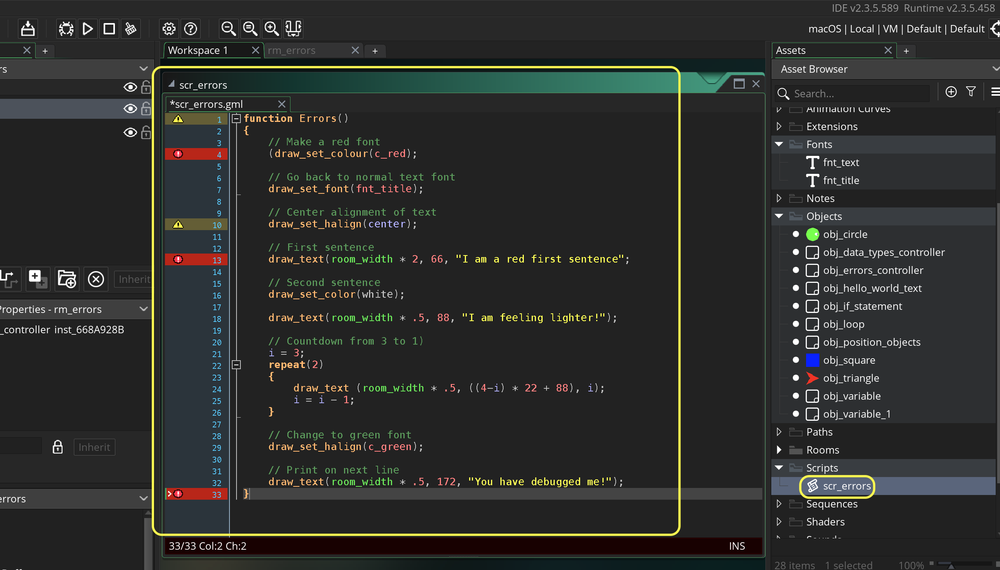

### GMS2 Errors


This tutorial is intended for those wanting an introduction to <i>GameMaker Studio 2</i> using their scrpting language <i>GML</i>. This assumes no prior knowledge of the software or scripting. This walk through looks at errors.  There are three kind of errors:

* Compile errors.  This is where the game does not compile so it cannot be run.  Often this is just a simple spelling mistake.

* Runtime errors.  These are errors that appear when playing the game.  These can be a bit trickier to track down.

* Logical errors.  These never break, crash or cause any warnings in the game.  They are just plain mistakes or wrong - resulting in an unwanted behavior.  Often we refer to these as bugs.

#### Software Needed
* Tested on GameMake Studio2.3.5.589
* An existing [GML Project](https://github.com/maubanel/GMS2-Snippets/blob/main/rename-project/README.md#user-content-rename-gms2-project)

<br>

---


##### `Step 1.`\|`ITB`|:small_blue_diamond:

Lets create a new room by *right-clicking* on **Rooms** in the **Asset Browser** tab and selecting **Create | Room**.  Call it `rm_errors`. Move the room to the top in the **Room Order** menu.


##### `Step 2.`\|`FHIU`|:small_blue_diamond: :small_blue_diamond: 

Right click on **Objects** title in the **Asset Browser** folder.  Select **Create | Object** and call it `obj_errors_controller`.


##### `Step 3.`\|`ITB`|:small_blue_diamond: :small_blue_diamond: :small_blue_diamond:

Lets start with heads up display (HUD) for this room.  Press the <kbd>Add Event</kbd> button and select a **Draw | Draw** event.


##### `Step 4.`\|`ITB`|:small_blue_diamond: :small_blue_diamond: :small_blue_diamond: :small_blue_diamond:

Type the following script in the newly created draw script.  Please mispell `draw_text` on purpose to show what happens if you mispell a function name.


##### `Step 5.`\|`ITB`| :small_orange_diamond:

*Double left click* on **rm_errors** to open the room and *drag and drop* the **obj_errors_controller** object into the room.


##### `Step 6.`\|`ITB`| :small_orange_diamond: :small_blue_diamond:

Now *press* the <kbd>Play</kbd> button in the top menu bar to launch the game. This time the game never runs.  At the very bottom there should be a tab whose title is Compile Errors.  Inside it reads the message `Object:obj_errors_controller Event:Draw at line 7: unknown function or script draw_tetx`.  Sometimes the errors can be a bit obtuse other times there are very precise.  Now we know which object, which event type and what line our error is in.


##### `Step 7.`\|`ITB`| :small_orange_diamond: :small_blue_diamond: :small_blue_diamond:

OK, lets fix the spelling mistake.  Please notice the color change in the editor. If you are using a gamemaker function or variable it will be an orange color and this is one tip that something is wrong. This only works for GML supplied names, as the ones we create ourselves will never be orange.


##### `Step 8.`\|`ITB`| :small_orange_diamond: :small_blue_diamond: :small_blue_diamond: :small_blue_diamond:

Now *press* the <kbd>Play</kbd> button in the top menu bar to launch the game. Now it loads the game up again.  This was the first type of error we will get in gamemaker a compile error. It means the compiler stops us from running the game as it has a problem trying to build the game executable.


##### `Step 9.`\|`ITB`| :small_orange_diamond: :small_blue_diamond: :small_blue_diamond: :small_blue_diamond: :small_blue_diamond:

Now lets look at some more errors.  Lets make the font a bit larger.  *Right click* on the **Fonts** title in the **Asset Browser** menu.  Select **Create | Font** from the menu and name the new font `fnt_title`</tt.> Change the **Style** to `Bold` and the **Size** to `24`.  This will be twice the size as the previous version.


##### `Step 10.`\|`ITB`| :large_blue_diamond:

Now reopen the **obj_errors_controller:Draw** event script and change the font before the draw text with a new function called **[draw_set_font(font](https://manual.yoyogames.com/GameMaker_Language/GML_Reference/Drawing/Text/draw_set_font.htm)**.


##### `Step 11.`\|`ITB`| :large_blue_diamond: :small_blue_diamond: 

Now mispell the font name in the parenthesis.  Look at what happens to the color of it?  Not only does GameMaker color its own variables and functions it also colors red resource names that it recognizes that you added to the resource list.  In this case if we don't spell it, it will look for a variable holding a font.   


##### `Step 12.`\|`ITB`| :large_blue_diamond: :small_blue_diamond: :small_blue_diamond: 

Run the game and we have a run time error where it can't find the font to load when trying to load the room.


##### `Step 13.`\|`ITB`| :large_blue_diamond: :small_blue_diamond: :small_blue_diamond:  :small_blue_diamond: 

OK, change the spelling back to `fnt_title` and fix the spelling error. Now *press* the <kbd>Play</kbd> button in the top menu bar to launch the game. The title is now a lot larger.  Now lets change the color of the font.


##### `Step 14.`\|`ITB`| :large_blue_diamond: :small_blue_diamond: :small_blue_diamond: :small_blue_diamond:  :small_blue_diamond: 

Now lets add the function **[draw_set_color(color)](https://manual.yoyogames.com/GameMaker_Language/GML_Reference/Drawing/Colour_And_Alpha/draw_set_colour.htm)**. This affects all colors after the line that you will be drawing (font or not).  Now make sure you mistype this on purpose with two `((` opening parenthesis and a *mispelled* color name (should be c_green and not just green).


##### `Step 15.`\|`ITB`| :large_blue_diamond: :small_orange_diamond: 

For an error that trips up the parser (it reads text and looks for issues like more opening parenthesis than closing ones) it will have a red highlight.  Now the issue with compiler issues is that the problem is not always on the line indicated.  In this case the first red box is correct but the second red box has no errors.  Often the error is not where the **IDE** thinks it is and you have to be careful.


##### `Step 16.`\|`ITB`| :large_blue_diamond: :small_orange_diamond:   :small_blue_diamond: 

Before fixing any errors run the game again by pressing the  Play Button. Take a look at the error.  Again, it gives you a hint to the first problem.  Notice that it says nothing about our second error at this point.  This is still a compile time error.


##### `Step 17.`\|`ITB`| :large_blue_diamond: :small_orange_diamond: :small_blue_diamond: :small_blue_diamond:

Fix the first error in the script by deleting the extra opening parenthesis.  Now *press* the <kbd>Play</kbd> button in the top menu bar to launch the game. This time it does run so it did compile and build the game.  But uh oh, it creates a run time error:


##### `Step 18.`\|`ITB`| :large_blue_diamond: :small_orange_diamond: :small_blue_diamond: :small_blue_diamond: :small_blue_diamond:

Run time errors are a little bit harder to fix and understand the error message.  The reason it compiled and run is it thought you had created a variable called green that you were calling.  In fact if you added the line `green = c_green`.
	
It would have ran fine (although you needlessly created another variable for the color green). The hint in the error message it says green... not set before reading it.  This is a very common error that occurs when we forget to give a variable a default initial value or mispell the name.  

Fix the error and run the game with the green font shown.


##### `Step 19.`\|`ITB`| :large_blue_diamond: :small_orange_diamond: :small_blue_diamond: :small_blue_diamond: :small_blue_diamond: :small_blue_diamond:

The next step is to call an existing script with errors in it.  Create a new font by clicking on **Font** and select **Create | Font** and call it `fnt_text`.  Letave the default settings.


##### `Step 20.`\|`ITB`| :large_blue_diamond: :large_blue_diamond:

Now right click on **Scripts** and select **Create | Script**.  Call it `src_errors`. Copy and paste the below to replace all text in the script. Please note this will be full of errors!

```gml
function Errors()
{
	// Make a red font
	(draw_set_colour(c_red);
	
	// Go back to normal text font
	draw_set_font(fnt_title);
	
	// Center alignment of text
	draw_set_halign(center);
	
	// First sentence 
	draw_text(room_width * 2, 66, "I am a red first sentence";
	
	// Second sentence
	draw_set_color(white);
	
	draw_text(room_width * .5, 88, "I am feeling lighter!");
	
	// Countdown from 3 to 1)
	i = 3;
	repeat(2)
	{
		draw_text (room_width * .5, ((4-i) * 22 + 88), i);
		i = i - 1;
	}
	
	// Change to green font
	draw_set_halign(c_green);
	
	// Print on next line
	draw_text(room_width * .5, 172, "You have debugged me!");
}
```



##### `Step 21.`\|`ITB`| :large_blue_diamond: :large_blue_diamond: :small_blue_diamond:

Open up **obj_errors** and call the script we just created `Errors()`; Now press the <kbd>Run</kbd> button and you will get compile errors in **scr_errors**.  


##### `Step 22.`\|`ITB`| :large_blue_diamond: :large_blue_diamond: :small_blue_diamond: :small_blue_diamond:

Open up **scr_errors** and fix all the errors in the script.  There are compile, runtime and syntax errors.  So you need to match the below exactly to fix all mistakes in the script.  Now complete this on your own and develop some experience debugging someone elses script!


##### `Step 23.`\|`ITB`| :large_blue_diamond: :large_blue_diamond: :small_blue_diamond: :small_blue_diamond: :small_blue_diamond:

Select the **File | Save Project** then press **File | Quit** to make sure everything in the game is saved. If you are using **GitHub** open up **GitHub Desktop** and add a title and longer description (if necessary) and press the <kbd>Commit to main</kbd> button. Finish by pressing **Push origin** to update the server with the latest changes.


| `gms2.variables`\|`THE END`| 
| :--- |
| **That's All Folks!** That's it for variables. |

___


